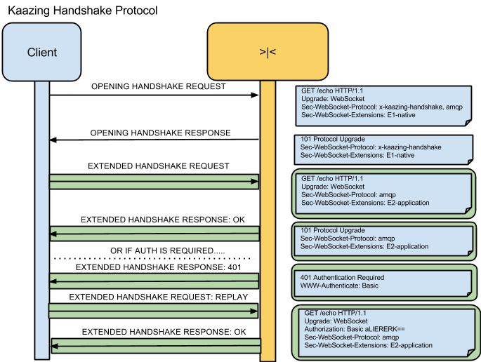

## WebSocket Protocol: x-kaazing-handshake

### Abstract

This document specifies the behavior of a WebSocket protocol called the “Kaazing WebSocket Handshake Protocol” (KHP).  It can be used to enable extended WebSocket capabilities for WebSocket clients. It is intended for use with native WebSocket implementations.

### Requirements

The key words "MUST", "MUST NOT", "REQUIRED", "SHALL", "SHALL NOT", "SHOULD", "SHOULD NOT", "RECOMMENDED", "MAY", and "OPTIONAL" in this document are to be interpreted as described in [RFC 2119](https://tools.ietf.org/html/rfc2119).

## Table of Contents

  * [Introduction](#introduction)
  * [Protocol Handshake Requirements](#protocol-handshake-requirements)
    * [Handshake Requirements for the Opening WebSocket Handshake](#handshake-requirements-for-the-opening-websocket-handshake)
    * [Handshake Requirements for the Extended WebSocket Handshake](#handshake-requirements-for-the-extended-websocket-handshake)
  * [Diagrams](#diagrams)
  * [Kaazing Extended Handshake Response Codes](#kaazing-extended-handshake-response-codes)
    * [1xx Informational](#1xx-informational)
    * [2xx success](#2xx-success)
    * [3xx Redirection](#3xx-redirection)
    * [4xx Client Error](#4xx-client-error)
    * [5xx Server Error](#5xx-server-error)
  * [References](#references)

### Introduction

The WebSocket protocol [[WSP](http://tools.ietf.org/html/draft-ietf-hybi-thewebsocketprotocol-17)] defines notions of extension and sub-protocols. [Section 1.9](http://tools.ietf.org/html/draft-ietf-hybi-thewebsocketprotocol-17#section-1.9) of [WSP] specifies that “WebSocket subprotocols” can be negotiated at time of initial handshake. This document describes a new Kaazing-specific sub-protocol whose role is to define an additional handshake, allowing the client to negotiate additional capabilities, loosely called “extensions”, or “application-class extensions” to distinguish these from [WSP] extensions.

The intention of this document is to define a WebSocket sub-protocol, named “x-kaazing-handshake” that allows for negotiation of available Kaazing-specific capabilities that will work over established native WebSocket connections.

The extended handshake defined in this document provides an opportunity for clients to negotiate application-class extensions after the WebSocket is established but before the application puts the WebSocket to use.

### Protocol Handshake Requirements

This section describes the handshake requirements necessary for establishing a WebSocket that speaks the KHP subprotocol.

There are two handshake request/response message pairs between a client and a server to establish a KHP WebSocket. The first request/response message pair is called the “Opening” handshake and is a standard WebSocket opening handshake using the HTTP protocol. This is to establish the raw WebSocket and to ensure that the KHP is the chosen protocol. 

The second message pair is called the “Extended” handshake; messages are sent using WebSocket messages over the established raw WebSocket. The WebSocket is not said to be _open_ until the second message pair has successfully completed.

An “extended” handshake MUST be required when KHP is the chosen protocol during the “opening” handshake.

#### Handshake Requirements for the Opening WebSocket Handshake

To negotiate the use of KHP, the WebSocket client MUST include the following sub-protocol value within the raw WebSocket handshake:

	x-kaazing-handshake

For example, the following header would be sufficient:

	Sec-WebSocket-Protocol: x-kaazing-handshake, amqp, ...

The rules defined in [WSP] apply to the server receiving such a WebSocket opening handshake.

If the server does agree to use the x-kaazing-handshake protocol, [[a]]()the server MUST send back a |Sec-WebSocket-Protocol| header field containing x-kaazing-handshake in its response.

#### Handshake Requirements for the Extended WebSocket Handshake

The extended handshake requires a WebSocket message from client to server (“extended handshake request”), followed by a server response to the client (“extended handshake response”). The extended handshake MUST only commence when the client and server successfully negotiate the “x-kaazing-handshake” protocol in the opening handshake. 

No other messages should be sent by client or server until the _extended handshake is completed_

The extended handshake WebSocket payloads take the form of HTTP Requests (for extended handshake requests) and HTTP Responses (for extended handshake responses) following the HTTP 1.1 protocol [RFC 2616].

| |
| --------------------- |
| Web Socket Frame |
| Http Request/Response |

If protocol negotiation was specified in the opening handshake, any protocols requested other than “x-kaazing-handshake” MUST be included in the extended handshake request as values in the header:

	Sec-WebSocket-Protocol:

If any WebSocket extensions were requested but not negotiated successfully in the opening handshake, then the client MUSTinclude any such extensions inside extended handshake request as values in the header:

	Sec-WebSocket-Extensions

The “Sec-WebSocket-Extensions” header MUST contain a non-empty list of extension names which the client desires, in an order of client preference, with the same semantics for the header as [WSP].

For example, inclusion of the following headers in the HTTP request payload within the first extended handshake request message indicates the client wishes to use a compression extension:

	Sec-WebSocket-Extensions: x-kaazing-compression

In the case that they are required, a client MAY include other headers in the first WebSocket message along with those above. This allows extension-specific information to be communicated between client and server without the need for additional handshakes.

A WebSocket server receiving the extended handshake message MUST respond with an extended handshake response message. 

In the case where the extended handshake contains an extension that was already negotiated in the opening handshake, the server MUST detect that condition and respond in error before _Closing the WebSocket Connection_.

The extended handshake response contains a HTTP status code which may or may not be “actionable”, as defined in a separate section below. When the extended handshake response has an HTTP status code that is not actionable, it is said that the _extended handshake failed_.

The actionable HTTP status codes are referenced in a separate section below. For the sake of example, some interesting response codes and their interpretation when seen in an extended handshake response are detailed in the table below.

| Extended Handshake Response Code | Client Behavior |
| ---------- | ---------- |
| 101 Switching Protocols | Clients receiving a 101 extended response SHOULD consider the _extended handshake completed_. |
| 302 Temporary Redirect | Clients receiving a 302 or 307 extended response MUST _Close the WebSocket Connection_ following the definition in [WSP], and proceed with a fresh opening handshake to the URL specified in the Location: header of the extended handshake response.  The client should make no more than a fixed maximum number of reconnect attempts when faced with these redirect codes.  Additionally, client is responsible for detecting redirect loops to matching resources and avoiding reconnection attempts in such scenarios. | 
| 401 Unauthorized | Clients receiving a 401 extended response SHOULD continue the extended handshake, and reply with a replayed extended handshake request containing additional authorization information.  If the client fails to reply in a timely manner, it is the server’s responsibility to _Close the WebSocket Connection_. |

The extended handshake response MAY include these headers: 

        Sec-WebSocket-Extensions

The “Sec-WebSocket-Extensions” header if present MUST contain a non-empty list of extensions, chosen from the requested extensions by the client and no others, which are to be used for further client-server communication.   If the “Sec-WebSocket-Extensions” header is not present, no extensions were negotiated and none apply.  Where there are no conflicts, the standard interpretation of this header as defined in [WSP] should also apply.

In the case that they are required, the server MAY include other headers in the WebSocket response message along with those above.  This allows information to be communicated from  server to client, in particular any reasons for failure.

The client then receives the extended handshake response message.  The client must _Close the WebSocket Connection_ following the definition in [WSP] if any of the following are true:
* the raw WebSocket opened during the opening handshake is closed
* the _extended handshake failed_
* the Sec-WebSocket-Extensions selected by the server are not a subset of  those requested

At this point, if the WebSocket is not closed, it is said that the _extended handshake is completed_.

### Diagrams 

Green means web socket framing around an HTTP payload content.

### Kaazing Extended Handshake Response Codes
This section captures the expected interpretation of the extended response by the client for each of the following embedded extended HTTP response code.  The definitions for the HTTP response codes were taken from the [List of HTTP Status Codes](https://en.wikipedia.org/wiki/List_of_HTTP_status_codes) on Wikipedia 10/20/2011.

#### 1xx Informational

Request received, continuing process.[[2]](https://en.wikipedia.org/wiki/List_of_HTTP_status_codes#cite_note-RFC_2616-1)

This class of status code indicates a provisional response, consisting only of the Status-Line and optional headers, and is terminated by an empty line. Since HTTP/1.0 did not define any 1xx status codes, serversmust not send a 1xx response to an HTTP/1.0 client except under experimental conditions.

| | |
| ---- | ----|
| HTTP Response Code | 100 Continue   This means that the server has received the request headers, and that the client should proceed to send the request body (in the case of a request for which a body needs to be sent; for example, a [POST](https://bit.ly/1dWx8n5) request. If the request body is large, sending it to a server when a request has already been rejected based upon inappropriate headers is inefficient. To have a server check if the request could be accepted based on the request's headers alone, a client must send Expect: 100-continue as a header in its initial request[[2]](https://en.wikipedia.org/wiki/List_of_HTTP_status_codes#cite_note-RFC_2616-1) and check if a 100 Continue status code is received in response before continuing (or receive 417 Expectation Failed and not continue).[[2]](https://en.wikipedia.org/wiki/List_of_HTTP_status_codes#cite_note-RFC_2616-1) |
| Extended Handshake Action | If the client requests this with an Expect: header, and the WebSocket server supports it, then this is a valid extended handshake response code, actionable on the client which MUST send the request body. |
	
| | |
| ---- | ---- |
| HTTP Response Code | 101 Switching Protocols   This means the requester has asked the server to switch protocols and the server is acknowledging that it will do so.[[2]](https://en.wikipedia.org/wiki/List_of_HTTP_status_codes#cite_note-RFC_2616-1) |
| Extended Handshake Action | Clients receiving a valid WebSocket handshake [WSP] 101 extended response that corresponds to their request MUST consider the _extended handshake completed_. |
	
| | |
| ---- | ---- |
| HTTP Response Code | 102 Processing [(WebDAV)](https://en.wikipedia.org/wiki/WebDAV) (RFC 2518)   As a WebDAV request may contain many sub-requests involving file operations, it may take a long time to complete the request. This code indicates that the server has received and is processing the request, but no response is available yet.[[3]](https://en.wikipedia.org/wiki/List_of_HTTP_status_codes#cite_note-RFC_2518-2) This prevents the client from timing out and assuming the request was lost. |
| Extended Handshake Action | A Client receiving this response MUST _Close the WebSocket Connection_ following the definition in [WSP]. |

| | |
| --- | --- |
|HTTP Response Code | 103 Checkpoint   This code is used in the Resumable HTTP Requests Proposal to resume aborted PUT or POST requests.[[4]](https://en.wikipedia.org/wiki/List_of_HTTP_status_codes#cite_note-ResumableHttpRequestsProposal-3) |
| Extended Handshake Action | A Client receiving this response MUST _Close the WebSocket Connection_ following the definition in [WSP]. |
	
| | |
| --- | ---|
| HTTP Response Code | 122 Request-URI too long   This is a non-standard IE7-only code which means the URI is longer than a maximum of 2083 characters.[[5]](https://en.wikipedia.org/wiki/List_of_HTTP_status_codes#cite_note-4)[[6]](https://en.wikipedia.org/wiki/List_of_HTTP_status_codes#cite_note-5) (See code 414.) |
| Extended Handshake Action | A Client receiving this response MUST _Close the WebSocket Connection_ following the definition in [WSP]. |

#### 2xx Success

This class of status codes indicates the action requested by the client was received, understood, accepted and processed successfully.

| | |
| --- | ---|
| HTTP Response Code | 200 OK   Standard response for successful HTTP requests. The actual response will depend on the request method used. In a GET request, the response will contain an entity corresponding to the requested resource. In a POST request the response will contain an entity describing or containing the result of the action.[[2]](https://en.wikipedia.org/wiki/List_of_HTTP_status_codes#cite_note-RFC_2616-1) |
| Extended Handshake Action | A Client receiving this response MUST _Close the WebSocket Connection_ following the definition in [WSP].  The intention of the extended handshake is to receive a 101 upgrade rather than obtain a successful response. |
	
| | |
| --- | ---|
| HTTP Response Code | 201 Created   The request has been fulfilled and resulted in a new resource being created.[[2]](https://en.wikipedia.org/wiki/List_of_HTTP_status_codes#cite_note-RFC_2616-1) |
| Extended Handshake Action | A Client receiving 201 extended response that corresponds to their request MUST consider the _extended handshake completed_.  The intention of the server using this response code rather than a 101 response code indicates that perhaps an emulated or alternative WebSocket has been established.  The content of the response and response headers will determine exactly which. |
	
| | |
| --- | ---|
| HTTP Response Code | 202 Accepted   The request has been accepted for processing, but the processing has not been completed. The request might or might not eventually be acted upon, as it might be disallowed when processing actually takes place.[[2]](https://en.wikipedia.org/wiki/List_of_HTTP_status_codes#cite_note-RFC_2616-1) |
| Extended Handshake Action | A client receiving this response can choose to wait for up to a maximum amount of time for another response, before _Closing the WebSocket Connection_. |
	
| | |
| --- | ---|
| HTTP Response Code | 203 Non-Authoritative Information (since HTTP/1.1)   The server successfully processed the request, but is returning information that may be from another source.[[2]](https://en.wikipedia.org/wiki/List_of_HTTP_status_codes#cite_note-RFC_2616-1) |
| Extended Handshake Action | A Client receiving this response MUST _Close the WebSocket Connection_ following the definition in [WSP]. |
	
| | |
| --- | ---|
| HTTP Response Code | 204 No Content   The server successfully processed the request, but is not returning any content.[[2]](https://en.wikipedia.org/wiki/List_of_HTTP_status_codes#cite_note-RFC_2616-1) |
| Extended Handshake Action | A Client receiving a 204 extended response that corresponds to their request MUST consider the _extended handshake completed_. |
	
| | |
| --- | ---|
| HTTP Response Code | 205 Reset Content   The server successfully processed the request, but is not returning any content. Unlike a 204 response, this response requires that the requester reset the document view.[[2]](https://en.wikipedia.org/wiki/List_of_HTTP_status_codes#cite_note-RFC_2616-1) |
| Extended Handshake Action | A Client receiving 205 extended response that corresponds to their request MUST consider the _extended handshake completed_. |
	
| | |
| --- | ---|
| HTTP Response Code | 206 Partial Content   The server is delivering only part of the resource due to a range header sent by the client. The range header is used by tools like [wget](https://en.wikipedia.org/wiki/Wget) to enable resuming of interrupted downloads, or split a download into multiple simultaneous streams.[[2]](https://en.wikipedia.org/wiki/List_of_HTTP_status_codes#cite_note-RFC_2616-1)
| Extended Handshake Action | A Client receiving this response MUST _Close the WebSocket Connection_ following the definition in [WSP]. |
	
| | |
| --- | ---|
| HTTP Response Code | 207 Multi-Status (WebDAV) (RFC 4918)   The message body that follows is an [XML](https://en.wikipedia.org/wiki/XML) message and can contain a number of separate response codes, depending on how many sub-requests were made.[[7]](https://en.wikipedia.org/wiki/List_of_HTTP_status_codes#cite_note-RFC_4918-6) |
| Extended Handshake Action | A Client receiving this response MUST _Close the WebSocket Connection_ following the definition in [WSP]. |
	
| | |
| --- | ---|
| HTTP Response Code | 226 IM Used (RFC 3229)   The server has fulfilled a GET request for the resource, and the response is a representation of the result of one or more instance-manipulations applied to the current instance. [8](https://en.wikipedia.org/wiki/List_of_HTTP_status_codes#cite_note-RFC_3229-7) |
| Extended Handshake Action | A Client receiving this response MUST _Close the WebSocket Connection_ following the definition in [WSP]. |

#### 3xx Redirection

The client must take additional action to complete the request.[2](https://en.wikipedia.org/wiki/List_of_HTTP_status_codes#cite_note-RFC_2616-1)
This class of status code indicates that further action needs to be taken by the user agent in order to fulfil the request. The action required may be carried out by the user agent without interaction with the user if and only if the method used in the second request is GET or HEAD. A user agent should not automatically redirect a request more than five times, since such redirections usually indicate an [infinite loop](https://en.wikipedia.org/wiki/Infinite_loop).

| | |
| --- | --- |
| HTTP Response Code | 300 Multiple Choices   Indicates multiple options for the resource that the client may follow. It, for instance, could be used to present different format options for video, list files with different [extensions](https://en.wikipedia.org/wiki/Filename_extension), or [word sense disambiguation](https://en.wikipedia.org/wiki/Word-sense_disambiguation).[[2]](https://en.wikipedia.org/wiki/List_of_HTTP_status_codes#cite_note-RFC_2616-1)
| Extended Handshake Action | A Client receiving this response MUST _Close the WebSocket Connection_ following the definition in [WSP], and SHOULD attempt an opening handshake on one of the given URIs in the choices presented. |
	
| | |
| --- | --- |
| HTTP Response Code | [301 Moved Permanently](https://en.wikipedia.org/wiki/HTTP_301)   This and all future requests should be directed to the given [URI](https://en.wikipedia.org/wiki/Uniform_resource_identifier).[[2]](https://en.wikipedia.org/wiki/List_of_HTTP_status_codes#cite_note-RFC_2616-1) |
| Extended Handshake Action | A Client receiving this response MUST _Close the WebSocket Connection_ following the definition in [WSP], and SHOULDattempt an opening handshake on the given URI. |
	
| | |
| --- | --- |
| HTTP Response Code | [302 Found](https://en.wikipedia.org/wiki/HTTP_302)   This is an example of industrial practice contradicting the standard.[[2]](https://en.wikipedia.org/wiki/List_of_HTTP_status_codes#cite_note-RFC_2616-1) HTTP/1.0 specification (RFC 1945) required the client to perform a temporary redirect (the original describing phrase was "Moved Temporarily"),[[9]](https://en.wikipedia.org/wiki/List_of_HTTP_status_codes#cite_note-RFC_1945-8) but popular browsers implemented 302 with the functionality of a 303 See Other. Therefore, HTTP/1.1 added status codes 303 and 307 to distinguish between the two behaviours.[[10]](https://en.wikipedia.org/wiki/List_of_HTTP_status_codes#cite_note-RFC2616-10-9) However, some Web applications and frameworks use the 302 status code as if it were the 303. |
| Extended Handshake Action | A Client receiving this response MUST _Close the WebSocket Connection_ following the definition in [WSP], and SHOULD attempt an opening handshake on the given URI. |
	
| | |
| --- | --- |
| HTTP Response Code | [303 See Other](https://en.wikipedia.org/wiki/HTTP_303) (since HTTP/1.1)   The response to the request can be found under another [URI](https://en.wikipedia.org/wiki/HTTP_303) using a GET method. When received in response to a POST (or PUT/DELETE), it should be assumed that the server has received the data and the redirect should be issued with a separate GET message.[[2]](https://en.wikipedia.org/wiki/List_of_HTTP_status_codes#cite_note-RFC_2616-1) |
| Extended Handshake Action | A Client receiving this response MUST _Close the WebSocket Connection_ following the definition in [WSP], and attempt an opening handshake on the given URI. |
	
| | |
| --- | --- |
| HTTP Response Code | 304 Not Modified   Indicates the resource has not been modified since last requested.[[2]](https://en.wikipedia.org/wiki/List_of_HTTP_status_codes#cite_note-RFC_2616-1) Typically, the HTTP client provides a header like the If-Modified-Since header to provide a time against which to compare. Using this saves bandwidth and reprocessing on both the server and client, as only the header data must be sent and received in comparison to the entirety of the page being re-processed by the server, then sent again using more bandwidth of the server and client. |
| Extended Handshake Action | A Client receiving this response MUST _Close the WebSocket Connection_ following the definition in [WSP] |
	
| | |
| --- | --- |
| HTTP Response Code | 305 Use Proxy (since HTTP/1.1)   Many HTTP clients (such as [Mozilla](https://en.wikipedia.org/wiki/Mozilla)[[11]](https://en.wikipedia.org/wiki/List_of_HTTP_status_codes#cite_note-mozilla_bugzilla_bug_187996-10) and [Internet Explorer](https://en.wikipedia.org/wiki/Internet_Explorer)) do not correctly handle responses with this status code, primarily for security reasons.[[2]](https://en.wikipedia.org/wiki/List_of_HTTP_status_codes#cite_note-RFC_2616-1) |
| Extended Handshake Action | A Client receiving this response MUST _Close the WebSocket Connection_ following the definition in [WSP] |
	
| | |
| --- | --- |
| HTTP Response Code | 306 Switch Proxy   No longer used.[[2]](https://en.wikipedia.org/wiki/List_of_HTTP_status_codes#cite_note-RFC_2616-1) Originally meant "Subsequent requests should use the specified proxy."[[12]](https://en.wikipedia.org/wiki/List_of_HTTP_status_codes#cite_note-11) |
| Extended Handshake Action | A Client receiving this response MUST _Close the WebSocket Connection_ following the definition in [WSP] |
	
| | |
| --- | --- |
| HTTP Response Code | 307 Temporary Redirect (since HTTP/1.1)   In this occasion, the request should be repeated with another URI, but future requests can still use the original URI.[[2]](https://en.wikipedia.org/wiki/List_of_HTTP_status_codes#cite_note-RFC_2616-1) In contrast to 303, the request method should not be changed when reissuing the original request. For instance, a POST request must be repeated using another POST request. |
| Extended Handshake Action | A Client receiving this response MUST _Close the WebSocket Connection_ following the definition in [WSP].  If and only if the underlying HTTP method was a GET request, the client MUST attempt an opening handshake on the given URI. |
	
| | |
| --- | --- |
| HTTP Response Code | 308 Resume Incomplete   This code is used in the Resumable HTTP Requests Proposal to resume aborted PUT or POST requests.[[4]](https://en.wikipedia.org/wiki/List_of_HTTP_status_codes#cite_note-ResumableHttpRequestsProposal-3) |
| Extended Handshake Action | A Client receiving this response MUST _Close the WebSocket Connection_ following the definition in [WSP] |

#### 4xx Client Error

The 4xx class of status code is intended for cases in which the client seems to have erred. Except when responding to a HEAD request, the server should include an entity containing an explanation of the error situation, and whether it is a temporary or permanent condition. These status codes are applicable to any request method. User agents should display any included entity to the user. These are typically the most common error codes encountered while online.

| | |
| --- | --- |
| HTTP Response Code | 400 Bad Request   The request cannot be fulfilled due to bad syntax.[[2]](https://en.wikipedia.org/wiki/List_of_HTTP_status_codes#cite_note-RFC_2616-1) |
| Extended Handshake Action | A Client receiving this response MUST _Close the WebSocket Connection_ following the definition in [WSP] |
	
| | |
| --- | --- |
| HTTP Response Code | 401 Unauthorized   Similar to 403 Forbidden, but specifically for use when authentication is possible but has failed or not yet been provided.[[2]](https://en.wikipedia.org/wiki/List_of_HTTP_status_codes#cite_note-RFC_2616-1) The response must include a WWW-Authenticate header field containing a challenge applicable to the requested resource. See [Basic access authentication](https://en.wikipedia.org/wiki/Basic_access_authentication) and [Digest access authentication](https://en.wikipedia.org/wiki/Digest_access_authentication). |
| Extended Handshake Action | Clients receiving a 401 extended response SHOULD continue the extended handshake, and reply with a replayed extended handshake request containing additional authorization information.  If the client fails to reply in a timely manner, it is the server’s responsibility to _Close the WebSocket Connection_. |
	
| | |
| --- | --- |
| HTTP Response Code | 402 Payment Required   Reserved for future use.[[2]](https://en.wikipedia.org/wiki/List_of_HTTP_status_codes#cite_note-RFC_2616-1) The original intention was that this code might be used as part of some form of [digital cash](https://en.wikipedia.org/wiki/Digital_currency) or [micropayment](https://en.wikipedia.org/wiki/Micropayment) scheme, but that has not happened, and this code is not usually used. As an example of its use, however, Apple's MobileMe service generates a 402 error ("httpStatusCode:402" in the Mac OS X Console log) if the MobileMe account is delinquent. |
| Extended Handshake Action | A Client receiving this response MUST _Close the WebSocket Connection_ following the definition in [WSP] |
	
| | |
| --- | --- |
| HTTP Response Code | [403 Forbidden](https://en.wikipedia.org/wiki/HTTP_403)   The request was a legal request, but the server is refusing to respond to it.[[2]](https://en.wikipedia.org/wiki/List_of_HTTP_status_codes#cite_note-RFC_2616-1) Unlike a 401 Unauthorized response, authenticating will make no difference.[[2]](https://en.wikipedia.org/wiki/List_of_HTTP_status_codes#cite_note-RFC_2616-1) |
| Extended Handshake Action | A Client receiving this response MUST _Close the WebSocket Connection_ following the definition in [WSP] |
	
| | |
| --- | --- |
| HTTP Response Code | [404 Not Found](https://en.wikipedia.org/wiki/HTTP_404)   The requested resource could not be found but may be available again in the future.[[2]](https://en.wikipedia.org/wiki/List_of_HTTP_status_codes#cite_note-RFC_2616-1) Subsequent requests by the client are permissible. |
| Extended Handshake Action | A Client receiving this response MUST _Close the WebSocket Connection_ following the definition in [WSP] |
	
| | |
| --- | --- |
| HTTP Response Code | 405 Method Not Allowed   A request was made of a resource using a request method not supported by that resource;[[2]](https://en.wikipedia.org/wiki/List_of_HTTP_status_codes#cite_note-RFC_2616-1) for example, using GET on a form which requires data to be presented via POST, or using PUT on a read-only resource. |
| Extended Handshake Action | A Client receiving this response MUST _Close the WebSocket Connection_ following the definition in [WSP] |
	
| | |
| --- | --- |
| HTTP Response Code | 406 Not Acceptable   The requested resource is only capable of generating content not acceptable according to the Accept headers sent in the request.[[2]](https://en.wikipedia.org/wiki/List_of_HTTP_status_codes#cite_note-RFC_2616-1) |
| Extended Handshake Action | A Client receiving this response MUST _Close the WebSocket Connection_ following the definition in [WSP] |
	
| | |
| --- | --- |
| HTTP Response Code | 407 Proxy Authentication Required   The client must first authenticate itself with the proxy.[[2]](https://en.wikipedia.org/wiki/List_of_HTTP_status_codes#cite_note-RFC_2616-1)
| Extended Handshake Action | A Client receiving this response MUST _Close the WebSocket Connection_ following the definition in [WSP], and MAY choose to attempt to authenticate with a proxy. |
	
| | |
| --- | --- |
| HTTP Response Code | 408 Request Timeout   The server timed out waiting for the request.[[2]](https://en.wikipedia.org/wiki/List_of_HTTP_status_codes#cite_note-RFC_2616-1) According to W3 HTTP specifications: "The client did not produce a request within the time that the server was prepared to wait. The client MAY repeat the request without modifications at any later time." |
| Extended Handshake Action | A Client receiving this response MUST _Close the WebSocket Connection_ following the definition in [WSP]. |
	
| | |
| --- | --- |
| HTTP Response Code | 409 Conflict   Indicates that the request could not be processed because of conflict in the request, such as an [edit conflict](https://en.wikipedia.org/wiki/Edit_conflict).[[2]](https://en.wikipedia.org/wiki/List_of_HTTP_status_codes#cite_note-RFC_2616-1) |
| Extended Handshake Action | A Client receiving this response MUST _Close the WebSocket Connection_ following the definition in [WSP] |
	
| | |
| --- | --- |
| HTTP Response Code | 410 Gone   Indicates that the resource requested is no longer available and will not be available again.[[2]](https://en.wikipedia.org/wiki/List_of_HTTP_status_codes#cite_note-RFC_2616-1) This should be used when a resource has been intentionally removed and the resource should be purged. Upon receiving a 410 status code, the client should not request the resource again in the future. Clients such as search engines should remove the resource from their indices. Most use cases do not require clients and search engines to purge the resource, and a "404 Not Found" may be used instead. |
| Extended Handshake Action | A Client receiving this response MUST _Close the WebSocket Connection_ following the definition in [WSP] |
	
| | |
| --- | --- |
| HTTP Response Code | 411 Length Required   The request did not specify the length of its content, which is required by the requested resource.[2](https://en.wikipedia.org/wiki/List_of_HTTP_status_codes#cite_note-RFC_2616-1) |
| Extended Handshake Action | A Client receiving this response MUST _Close the WebSocket Connection_ following the definition in [WSP] |
	
| | |
| --- | --- |
| HTTP Response Code | 412 Precondition Failed   The server does not meet one of the preconditions that the requester put on the request.[2](https://en.wikipedia.org/wiki/List_of_HTTP_status_codes#cite_note-RFC_2616-1) |
| Extended Handshake Action | A Client receiving this response MUST _Close the WebSocket Connection_ following the definition in [WSP] |
	
| | |
| --- | --- |
| HTTP Response Code | 413 Request Entity Too Large   The request is larger than the server is willing or able to process.[2](https://en.wikipedia.org/wiki/List_of_HTTP_status_codes#cite_note-RFC_2616-1) |
| Extended Handshake Action | A Client receiving this response MUST _Close the WebSocket Connection_ following the definition in [WSP] |
	
| | |
| --- | --- |
| HTTP Response Code | 414 Request-URI Too Long   The [URI](https://en.wikipedia.org/wiki/Uniform_resource_identifier) provided was too long for the server to process.[2](https://en.wikipedia.org/wiki/List_of_HTTP_status_codes#cite_note-RFC_2616-1) |
| Extended Handshake Action | A Client receiving this response MUST _Close the WebSocket Connection_ following the definition in [WSP] |
	
| | |
| --- | --- |
| HTTP Response Code | 415 Unsupported Media Type   The request entity has a [media type](https://en.wikipedia.org/wiki/Internet_media_type) which the server or resource does not support.[[2]](https://en.wikipedia.org/wiki/List_of_HTTP_status_codes#cite_note-RFC_2616-1) For example, the client uploads an image as [image/svg+xml](https://en.wikipedia.org/wiki/Scalable_Vector_Graphics), but the server requires that images use a different format. |
| Extended Handshake Action | A Client receiving this response MUST _Close the WebSocket Connection_ following the definition in [WSP] |
	
| | |
| --- | --- |
| HTTP Response Code | 416 Requested Range Not Satisfiable   The client has asked for a portion of the file, but the server cannot supply that portion.[2](https://en.wikipedia.org/wiki/List_of_HTTP_status_codes#cite_note-RFC_2616-1) For example, if the client asked for a part of the file that lies beyond the end of the file. |
| Extended Handshake Action | A Client receiving this response MUST _Close the WebSocket Connection_ following the definition in [WSP] |
	
| | |
| --- | --- |
| HTTP Response Code | 417 Expectation Failed   The server cannot meet the requirements of the Expect request-header field.[2](https://en.wikipedia.org/wiki/List_of_HTTP_status_codes#cite_note-RFC_2616-1) |
| Extended Handshake Action | A Client receiving this response MUST _Close the WebSocket Connection_ following the definition in [WSP] |
	
| | |
| --- | --- |
| HTTP Response Code | 418 I'm a teapot (RFC 2324)   This code was defined in 1998 as one of the traditional [IETF](https://en.wikipedia.org/wiki/Internet_Engineering_Task_Force) [April Fools' jokes](https://en.wikipedia.org/wiki/April_Fools%27_Day_Request_for_Comments), in [RFC 2324](http://tools.ietf.org/html/rfc2324), [Hyper Text Coffee Pot Control Protocol](https://en.wikipedia.org/wiki/Hyper_Text_Coffee_Pot_Control_Protocol), and is not expected to be implemented by actual HTTP servers. |
| Extended Handshake Action | A Client receiving this response MUST _Close the WebSocket Connection_ following the definition in [WSP] |
	
| | |
| --- | --- |
| HTTP Response Code | 422 Unprocessable Entity (WebDAV) (RFC 4918)   The request was well-formed but was unable to be followed due to semantic errors.[[7]](https://en.wikipedia.org/wiki/List_of_HTTP_status_codes#cite_note-RFC_4918-6) |
| Extended Handshake Action | A Client receiving this response MUST _Close the WebSocket Connection_ following the definition in [WSP] |
	
| | |
| --- | --- |
| HTTP Response Code | 423 Locked (WebDAV) (RFC 4918)   The resource that is being accessed is locked.[[7]](https://en.wikipedia.org/wiki/List_of_HTTP_status_codes#cite_note-RFC_4918-6) |
| Extended Handshake Action | A Client receiving this response MUST _Close the WebSocket Connection_ following the definition in [WSP] |
	
| | |
| --- | --- |
| HTTP Response Code | 424 Failed Dependency (WebDAV) (RFC 4918)   The request failed due to failure of a previous request (e.g. a PROPPATCH).[[7]](https://en.wikipedia.org/wiki/List_of_HTTP_status_codes#cite_note-RFC_4918-6) |
| Extended Handshake Action | A Client receiving this response MUST _Close the WebSocket Connection_ following the definition in [WSP] |
	
| | |
| --- | --- |
| HTTP Response Code | 425 Unordered Collection (RFC 3648)   Defined in drafts of "WebDAV Advanced Collections Protocol",[[13]](https://en.wikipedia.org/wiki/List_of_HTTP_status_codes#cite_note-WEBDAV_CP_04-12) but not present in "Web Distributed Authoring and Versioning (WebDAV) Ordered Collections Protocol".[[14]](https://en.wikipedia.org/wiki/List_of_HTTP_status_codes#cite_note-RFC_3648-13) |
| Extended Handshake Action | A Client receiving this response MUST _Close the WebSocket Connection_ following the definition in [WSP] |
	
| | |
| --- | --- |
| HTTP Response Code | 426 Upgrade Required (RFC 2817)   The client should switch to a different protocol such as [TLS/1.0](https://en.wikipedia.org/wiki/Transport_Layer_Security).[[15]](https://en.wikipedia.org/wiki/List_of_HTTP_status_codes#cite_note-RFC_2817-14) |
| Extended Handshake Action | A Client receiving this response MUST _Close the WebSocket Connection_ following the definition in [WSP], and MAY attempt to establish a new opening handshake using an upgraded protocol. |
	
| | |
| --- | --- |
| HTTP Response Code | 428 Precondition Required   The origin server requires the request to be conditional. Intended to prevent "the 'lost update' problem, where a client GETs a resource's state, modifies it, and PUTs it back to the server, when meanwhile a third party has modified the state on the server, leading to a conflict."[[16]](https://en.wikipedia.org/wiki/List_of_HTTP_status_codes#cite_note-http-new-status-02-15) Proposed in an Internet-Draft.   A Client receiving this response MUST _Close the WebSocket Connection_ following the definition in [WSP] |
| Extended Handshake Action | A Client receiving this response MUST _Close the WebSocket Connection_ following the definition in [WSP] |
	
| | |
| --- | --- |
| HTTP Response Code | 429 Too Many Requests   The user has sent too many requests in a given amount of time. Intended for use with [rate limiting](https://en.wikipedia.org/wiki/Rate_limiting) schemes. Proposed in an Internet-Draft.[[16]](https://en.wikipedia.org/wiki/List_of_HTTP_status_codes#cite_note-http-new-status-02-15) |
| Extended Handshake Action | A Client receiving this response MUST _Close the WebSocket Connection_ following the definition in [WSP] |
	
| | |
| --- | --- |
| HTTP Response Code | 431 Request Header Fields Too Large   The server is unwilling to process the request because either an individual header field, or all the header fields collectively, are too large. Proposed in an Internet-Draft.[[16]](https://en.wikipedia.org/wiki/List_of_HTTP_status_codes#cite_note-http-new-status-02-15) |
| Extended Handshake Action | A Client receiving this response MUST _Close the WebSocket Connection_ following the definition in [WSP] |
	
| | |
| --- | --- |
| HTTP Response Code | 444 No Response   A [Nginx](https://en.wikipedia.org/wiki/Nginx) HTTP server extension. The server returns no information to the client and closes the connection (useful as a deterrent for malware). |
| Extended Handshake Action | A Client receiving this response MUST _Close the WebSocket Connection_ following the definition in [WSP] |
	
| | |
| --- | --- |
| HTTP Response Code | 449 Retry With   A Microsoft extension. The request should be retried after performing the appropriate action.[[17]](https://en.wikipedia.org/wiki/List_of_HTTP_status_codes#cite_note-MS_DD891478-16) |
| Extended Handshake Action | A Client receiving this response MUST _Close the WebSocket Connection_ following the definition in [WSP] |
	
| | |
| --- | --- |
| HTTP Response Code | 450 Blocked by Windows Parental Controls   A Microsoft extension. This error is given when Windows Parental Controls are turned on and are blocking access to the given webpage.[[18]](https://en.wikipedia.org/wiki/List_of_HTTP_status_codes#cite_note-17) |
| Extended Handshake Action | A Client receiving this response MUST _Close the WebSocket Connection_ following the definition in [WSP] |
	
| | |
| --- | --- |
| HTTP Response Code | 499 Client Closed Request   An Nginx HTTP server extension. This code is introduced to log the case when the connection is closed by client while HTTP server is processing its request, making server unable to send the HTTP header back.[[19]](https://en.wikipedia.org/wiki/List_of_HTTP_status_codes#cite_note-Nginx_mailing_list.2C_2007-08-27-18) |
| Extended Handshake Action | A Client receiving this response MUST _Close the WebSocket Connection_ following the definition in [WSP] |
	

#### 5xx Server Error

The server failed to fulfill an apparently valid request.[[2]](https://en.wikipedia.org/wiki/List_of_HTTP_status_codes#cite_note-RFC_2616-1)  

Response status codes beginning with the digit "5" indicate cases in which the server is aware that it has encountered an error or is otherwise incapable of performing the request. Except when responding to a HEAD request, the server should include an entity containing an explanation of the error situation, and indicate whether it is a temporary or permanent condition. Likewise, user agents should display any included entity to the user. These response codes are applicable to any request method.

| | |
| --- | --- |
| HTTP Response Code | 500 Internal Server Error   A generic error message, given when no more specific message is suitable.[[2]](https://en.wikipedia.org/wiki/List_of_HTTP_status_codes#cite_note-RFC_2616-1) |
| Extended Handshake Action | A Client receiving this response MUST _Close the WebSocket Connection_ following the definition in [WSP]. |
	
| | |
| --- | --- |
| HTTP Response Code | 501 Not Implemented   The server either does not recognise the request method, or it lacks the ability to fulfill the request.[[2]](https://en.wikipedia.org/wiki/List_of_HTTP_status_codes#cite_note-RFC_2616-1) |
| Extended Handshake Action | A Client receiving this response MUST _Close the WebSocket Connection_ following the definition in [WSP]. |
	
| | |
| --- | --- |
| HTTP Response Code | 502 Bad Gateway   The server was acting as a gateway or proxy and received an invalid response from the upstream server.[[2]](https://en.wikipedia.org/wiki/List_of_HTTP_status_codes#cite_note-RFC_2616-1) |
| Extended Handshake Action | A Client receiving this response MUST _Close the WebSocket Connection_ following the definition in [WSP]. |
	
| | |
| --- | --- |
| HTTP Response Code | 503 Service Unavailable   The server is currently unavailable (because it is overloaded or down for maintenance).[[2]](https://en.wikipedia.org/wiki/List_of_HTTP_status_codes#cite_note-RFC_2616-1) Generally, this is a temporary state. |
| Extended Handshake Action | A Client receiving this response MUST _Close the WebSocket Connection_ following the definition in [WSP]. |
	
| | |
| --- | --- |
| HTTP Response Code | 504 Gateway Timeout   The server was acting as a gateway or proxy and did not receive a timely response from the upstream server.[[2]](https://en.wikipedia.org/wiki/List_of_HTTP_status_codes#cite_note-RFC_2616-1) |
| Extended Handshake Action | A Client receiving this response MUST _Close the WebSocket Connection_ following the definition in [WSP]. |
	
| | |
| --- | --- |
| HTTP Response Code | 505 HTTP Version Not Supported   The server does not support the HTTP protocol version used in the request.[[2]](https://en.wikipedia.org/wiki/List_of_HTTP_status_codes#cite_note-RFC_2616-1) |
| Extended Handshake Action | A Client receiving this response MUST _Close the WebSocket Connection_ following the definition in [WSP]. |
	
| | |
| --- | --- |
| HTTP Response Code | 506 Variant Also Negotiates (RFC 2295)   Transparent [content negotiation](https://en.wikipedia.org/wiki/Content_negotiation) for the request results in a [circular reference](https://en.wikipedia.org/wiki/Circular_reference).[[20]](https://en.wikipedia.org/wiki/List_of_HTTP_status_codes#cite_note-RFC_2295-19) |
| Extended Handshake Action | A Client receiving this response MUST _Close the WebSocket Connection_ following the definition in [WSP]. |
	
| | |
| --- | --- |
| HTTP Response Code | 507 Insufficient Storage (WebDAV) (RFC 4918)   The server is unable to store the representation needed to complete the request.[[7]](https://en.wikipedia.org/wiki/List_of_HTTP_status_codes#cite_note-RFC_4918-6) |
| Extended Handshake Action | A Client receiving this response MUST _Close the WebSocket Connection_ following the definition in [WSP]. |
	
| | |
| --- | --- |
| HTTP Response Code | 509 Bandwidth Limit Exceeded (Apache bw/limited extension)   This status code, while used by many servers, is not specified in any RFCs. |
| Extended Handshake Action | A Client receiving this response MUST _Close the WebSocket Connection_ following the definition in [WSP]. |
	
| | |
| --- | --- |
| HTTP Response Code | 510 Not Extended (RFC 2774)   Further extensions to the request are required for the server to fulfill it.[[21]](https://en.wikipedia.org/wiki/List_of_HTTP_status_codes#cite_note-RFC_2774-20) |
| Extended Handshake Action | A Client receiving this response MUST _Close the WebSocket Connection_ following the definition in [WSP]. |
	
| | |
| --- | --- |
| HTTP Response Code | 511 Network Authentication Required   The client needs to authenticate to gain network access. Intended for use by intercepting proxies used to control access to the network (e.g. "captive portals" used to require agreement to Terms of Service before granting full Internet access via a Wi-Fi hotspot). Proposed in an Internet-Draft.[[16]](https://en.wikipedia.org/wiki/List_of_HTTP_status_codes#cite_note-http-new-status-02-15) |
| Extended Handshake Action | A Client receiving this response MUST _Close the WebSocket Connection_ following the definition in [WSP]. |
	
| | |
| --- | --- |
| HTTP Response Code | 598 (Informal convention) network read timeout error   This status code is not specified in any RFCs, but is used by some HTTP proxies to signal a network read timeout behind the proxy to a client in front of the proxy. |
| Extended Handshake Action | A Client receiving this response MUST _Close the WebSocket Connection_ following the definition in [WSP]. |
	
| | |
| --- | --- |
| HTTP Response Code | 599 (Informal convention) network connect timeout error   This status code is not specified in any RFCs, but is used by some HTTP proxies to signal a network connect timeout behind the proxy to a client in front of the proxy. |
| Extended Handshake Action | A Client receiving this response MUST _Close the WebSocket Connection_ following the definition in [WSP]. |
	
## References

[RFC2119] Bradner, S., "Key words for use in RFCs to Indicate Requirement Levels", [BCP 14](https://tools.ietf.org/html/bcp14), [RFC 2119](https://tools.ietf.org/html/rfc2119), March 1997.

[WSP] The WebSocket Protocol, I.Fette, IETF, [WSP](http://tools.ietf.org/html/rfc6455)

[RFC822 Section 3.1] David H. Crocker, University of Delaware, [RFC822 Section 3.1](http://tools.ietf.org/html/rfc822#section-3.1)

[RFC 2616] [HTTP 1.1 Protocol Specification](https://tools.ietf.org/html/rfc2616)

1.  ["The HTTP status codes in IIS 7.0"](https://support.microsoft.com/en-us/kb/943891).[Microsoft](https://en.wikipedia.org/wiki/Microsoft). July 14, 2009\. Retrieved April 1, 2009.
2.  [a](https://en.wikipedia.org/wiki/List_of_HTTP_status_codes#cite_ref-RFC_2616_1-0)[b](http://www.google.com/url?q=http%3A%2F%2Fen.wikipedia.org%2Fwiki%2FList_of_HTTP_status_codes%23cite_ref-RFC_2616_1-1&sa=D&sntz=1&usg=AFQjCNE0UiZ5cp2vG2aQrqKSMvAEN9wwIw)[c](http://www.google.com/url?q=http%3A%2F%2Fen.wikipedia.org%2Fwiki%2FList_of_HTTP_status_codes%23cite_ref-RFC_2616_1-2&sa=D&sntz=1&usg=AFQjCNHFxvQpeG7I4vF0t5Pqm8GFN0uirw)[d](http://www.google.com/url?q=http%3A%2F%2Fen.wikipedia.org%2Fwiki%2FList_of_HTTP_status_codes%23cite_ref-RFC_2616_1-3&sa=D&sntz=1&usg=AFQjCNHCC30EKgcAoX4yTYCZ7BNR8YJQdA)[e](http://www.google.com/url?q=http%3A%2F%2Fen.wikipedia.org%2Fwiki%2FList_of_HTTP_status_codes%23cite_ref-RFC_2616_1-4&sa=D&sntz=1&usg=AFQjCNFy0Gao9RAkwfHXm1QzBb1clVQmKA)[f](http://www.google.com/url?q=http%3A%2F%2Fen.wikipedia.org%2Fwiki%2FList_of_HTTP_status_codes%23cite_ref-RFC_2616_1-5&sa=D&sntz=1&usg=AFQjCNFvLwr_g4zzYKdVWfeNHg0lSF58lw)[g](http://www.google.com/url?q=http%3A%2F%2Fen.wikipedia.org%2Fwiki%2FList_of_HTTP_status_codes%23cite_ref-RFC_2616_1-6&sa=D&sntz=1&usg=AFQjCNFv8nMWCmldOAqrLiXbl07F_A8L0Q)[h](http://www.google.com/url?q=http%3A%2F%2Fen.wikipedia.org%2Fwiki%2FList_of_HTTP_status_codes%23cite_ref-RFC_2616_1-7&sa=D&sntz=1&usg=AFQjCNH6C4q1D5g3ZAWie6R8xewVTdnjHQ)[i](http://www.google.com/url?q=http%3A%2F%2Fen.wikipedia.org%2Fwiki%2FList_of_HTTP_status_codes%23cite_ref-RFC_2616_1-8&sa=D&sntz=1&usg=AFQjCNEKT3I5BnTDd0xPdY5K9vLYHpnwHQ)[j](http://www.google.com/url?q=http%3A%2F%2Fen.wikipedia.org%2Fwiki%2FList_of_HTTP_status_codes%23cite_ref-RFC_2616_1-9&sa=D&sntz=1&usg=AFQjCNGCn-FX2o45A_O4uSD4mDCL8CKDBw)[k](http://www.google.com/url?q=http%3A%2F%2Fen.wikipedia.org%2Fwiki%2FList_of_HTTP_status_codes%23cite_ref-RFC_2616_1-10&sa=D&sntz=1&usg=AFQjCNEKlsac5slWzi4NwYbbDX_LXmKtKg)[l](http://www.google.com/url?q=http%3A%2F%2Fen.wikipedia.org%2Fwiki%2FList_of_HTTP_status_codes%23cite_ref-RFC_2616_1-11&sa=D&sntz=1&usg=AFQjCNE9uMp8B7T50VSqx7dKGtkj_cjBWw)[m](http://www.google.com/url?q=http%3A%2F%2Fen.wikipedia.org%2Fwiki%2FList_of_HTTP_status_codes%23cite_ref-RFC_2616_1-12&sa=D&sntz=1&usg=AFQjCNG4shQ8qVBqAJYIdmoJ0fAjRt_iog)[n](http://www.google.com/url?q=http%3A%2F%2Fen.wikipedia.org%2Fwiki%2FList_of_HTTP_status_codes%23cite_ref-RFC_2616_1-13&sa=D&sntz=1&usg=AFQjCNG1fjOnLTB_HFZFBviQxh7pET4rSA)[o](http://www.google.com/url?q=http%3A%2F%2Fen.wikipedia.org%2Fwiki%2FList_of_HTTP_status_codes%23cite_ref-RFC_2616_1-14&sa=D&sntz=1&usg=AFQjCNF0PwFNXOTIEn_j1Zl6YkUpHO9q1A)[p](http://www.google.com/url?q=http%3A%2F%2Fen.wikipedia.org%2Fwiki%2FList_of_HTTP_status_codes%23cite_ref-RFC_2616_1-15&sa=D&sntz=1&usg=AFQjCNG1Ktx4NxksvUV3hrolRieZ_cHgMw)[q](http://www.google.com/url?q=http%3A%2F%2Fen.wikipedia.org%2Fwiki%2FList_of_HTTP_status_codes%23cite_ref-RFC_2616_1-16&sa=D&sntz=1&usg=AFQjCNFLb9krNHdrb-atMAH-71HFOmFv9g)[r](http://www.google.com/url?q=http%3A%2F%2Fen.wikipedia.org%2Fwiki%2FList_of_HTTP_status_codes%23cite_ref-RFC_2616_1-17&sa=D&sntz=1&usg=AFQjCNGpba0brOdCPut0kolvuiYm1oWO_w)[s](http://www.google.com/url?q=http%3A%2F%2Fen.wikipedia.org%2Fwiki%2FList_of_HTTP_status_codes%23cite_ref-RFC_2616_1-18&sa=D&sntz=1&usg=AFQjCNE6yzsFAJqIlLq_IFOeZZN2BCu0Yw)[t](http://www.google.com/url?q=http%3A%2F%2Fen.wikipedia.org%2Fwiki%2FList_of_HTTP_status_codes%23cite_ref-RFC_2616_1-19&sa=D&sntz=1&usg=AFQjCNETsDjHsTZBF4tNfHtJ7GfOizTbpA)[u](http://www.google.com/url?q=http%3A%2F%2Fen.wikipedia.org%2Fwiki%2FList_of_HTTP_status_codes%23cite_ref-RFC_2616_1-20&sa=D&sntz=1&usg=AFQjCNFAMvDRRoqbzosXDhWHBNiFEwlINg)[v](http://www.google.com/url?q=http%3A%2F%2Fen.wikipedia.org%2Fwiki%2FList_of_HTTP_status_codes%23cite_ref-RFC_2616_1-21&sa=D&sntz=1&usg=AFQjCNF37Xz5DEBmgNNczo-PlJbfsBtsRQ)[w](http://www.google.com/url?q=http%3A%2F%2Fen.wikipedia.org%2Fwiki%2FList_of_HTTP_status_codes%23cite_ref-RFC_2616_1-22&sa=D&sntz=1&usg=AFQjCNGQlX9AGC_wgUHP_eEKrF5hBP4FDQ)[x](http://www.google.com/url?q=http%3A%2F%2Fen.wikipedia.org%2Fwiki%2FList_of_HTTP_status_codes%23cite_ref-RFC_2616_1-23&sa=D&sntz=1&usg=AFQjCNG_0SqDlHm1j_UQaEhRv2NbF_Fz8A)[y](http://www.google.com/url?q=http%3A%2F%2Fen.wikipedia.org%2Fwiki%2FList_of_HTTP_status_codes%23cite_ref-RFC_2616_1-24&sa=D&sntz=1&usg=AFQjCNEKs1vEgf_4X1Pz-OGPrMtV-NAEUQ)[z](http://www.google.com/url?q=http%3A%2F%2Fen.wikipedia.org%2Fwiki%2FList_of_HTTP_status_codes%23cite_ref-RFC_2616_1-25&sa=D&sntz=1&usg=AFQjCNGV4ZE7qWT3Gh3hwUdGqq_El6hOIw)[aa](http://www.google.com/url?q=http%3A%2F%2Fen.wikipedia.org%2Fwiki%2FList_of_HTTP_status_codes%23cite_ref-RFC_2616_1-26&sa=D&sntz=1&usg=AFQjCNHhd-HxVFzH2XPN-McT_Rgs3b_IXQ)[ab](http://www.google.com/url?q=http%3A%2F%2Fen.wikipedia.org%2Fwiki%2FList_of_HTTP_status_codes%23cite_ref-RFC_2616_1-27&sa=D&sntz=1&usg=AFQjCNGB4wmhQwB_Ze1H1KJfloLPxBPTRA)[ac](http://www.google.com/url?q=http%3A%2F%2Fen.wikipedia.org%2Fwiki%2FList_of_HTTP_status_codes%23cite_ref-RFC_2616_1-28&sa=D&sntz=1&usg=AFQjCNF6wpBoS4mZrl1Gk6qMB0qz0TyArQ)[ad](http://www.google.com/url?q=http%3A%2F%2Fen.wikipedia.org%2Fwiki%2FList_of_HTTP_status_codes%23cite_ref-RFC_2616_1-29&sa=D&sntz=1&usg=AFQjCNG4h2jRDoEX6I6Q9CTKw1Jba-GDUQ)[ae](http://www.google.com/url?q=http%3A%2F%2Fen.wikipedia.org%2Fwiki%2FList_of_HTTP_status_codes%23cite_ref-RFC_2616_1-30&sa=D&sntz=1&usg=AFQjCNGbiWhu2jH7Wt6Au_dywo1aJEbf9A)[af](http://www.google.com/url?q=http%3A%2F%2Fen.wikipedia.org%2Fwiki%2FList_of_HTTP_status_codes%23cite_ref-RFC_2616_1-31&sa=D&sntz=1&usg=AFQjCNHzNMiJ6MVta1lLs4h_GsQUU0Vpxg)[ag](http://www.google.com/url?q=http%3A%2F%2Fen.wikipedia.org%2Fwiki%2FList_of_HTTP_status_codes%23cite_ref-RFC_2616_1-32&sa=D&sntz=1&usg=AFQjCNHL2vfhmv-vrVry5PaQ_aSGhg4U2g)[ah](http://www.google.com/url?q=http%3A%2F%2Fen.wikipedia.org%2Fwiki%2FList_of_HTTP_status_codes%23cite_ref-RFC_2616_1-33&sa=D&sntz=1&usg=AFQjCNGKBVJ-570opj-I6fcYhtMnuVJRUA)[ai](http://www.google.com/url?q=http%3A%2F%2Fen.wikipedia.org%2Fwiki%2FList_of_HTTP_status_codes%23cite_ref-RFC_2616_1-34&sa=D&sntz=1&usg=AFQjCNEPhDhw2RIfLVys-6TaSxifiW1MBw)[aj](http://www.google.com/url?q=http%3A%2F%2Fen.wikipedia.org%2Fwiki%2FList_of_HTTP_status_codes%23cite_ref-RFC_2616_1-35&sa=D&sntz=1&usg=AFQjCNGuoRhz6WnJ1idUb1XbJI7HcrqDYQ)[ak](http://www.google.com/url?q=http%3A%2F%2Fen.wikipedia.org%2Fwiki%2FList_of_HTTP_status_codes%23cite_ref-RFC_2616_1-36&sa=D&sntz=1&usg=AFQjCNEoaqtELQaJS-uwioneLG7voGnv1A)[al](http://www.google.com/url?q=http%3A%2F%2Fen.wikipedia.org%2Fwiki%2FList_of_HTTP_status_codes%23cite_ref-RFC_2616_1-37&sa=D&sntz=1&usg=AFQjCNHmuDSuDd3RWcG2tG__oTBbxV5SEg)[am](http://www.google.com/url?q=http%3A%2F%2Fen.wikipedia.org%2Fwiki%2FList_of_HTTP_status_codes%23cite_ref-RFC_2616_1-38&sa=D&sntz=1&usg=AFQjCNEI5CYF5HPcopHPfNZ2sihRcccx8g)[an](http://www.google.com/url?q=http%3A%2F%2Fen.wikipedia.org%2Fwiki%2FList_of_HTTP_status_codes%23cite_ref-RFC_2616_1-39&sa=D&sntz=1&usg=AFQjCNHt7q6_t63dCq5wTXI_5LAUaIlKnQ)[ao](http://www.google.com/url?q=http%3A%2F%2Fen.wikipedia.org%2Fwiki%2FList_of_HTTP_status_codes%23cite_ref-RFC_2616_1-40&sa=D&sntz=1&usg=AFQjCNGv25V5zc0sASO87LZH0LhczD7U-A)[ap](http://www.google.com/url?q=http%3A%2F%2Fen.wikipedia.org%2Fwiki%2FList_of_HTTP_status_codes%23cite_ref-RFC_2616_1-41&sa=D&sntz=1&usg=AFQjCNHc7LvP9gWRuH0R-nNIEd5XSViglg)[aq](http://www.google.com/url?q=http%3A%2F%2Fen.wikipedia.org%2Fwiki%2FList_of_HTTP_status_codes%23cite_ref-RFC_2616_1-42&sa=D&sntz=1&usg=AFQjCNHdWsgtJt6Kacl2N_rZpJH_EwYNoQ)[ar](http://www.google.com/url?q=http%3A%2F%2Fen.wikipedia.org%2Fwiki%2FList_of_HTTP_status_codes%23cite_ref-RFC_2616_1-43&sa=D&sntz=1&usg=AFQjCNEGxs-2neK1Sle43l-ZUI2q68-oPw)[as](http://www.google.com/url?q=http%3A%2F%2Fen.wikipedia.org%2Fwiki%2FList_of_HTTP_status_codes%23cite_ref-RFC_2616_1-44&sa=D&sntz=1&usg=AFQjCNFyqCYxUctIdtAsVF-hJh2JMDKqmw)[at](http://www.google.com/url?q=http%3A%2F%2Fen.wikipedia.org%2Fwiki%2FList_of_HTTP_status_codes%23cite_ref-RFC_2616_1-45&sa=D&sntz=1&usg=AFQjCNFBj4e-w8EoBx5FZs0jZsgQeRIAdQ)[Fielding, Roy T.](http://www.google.com/url?q=http%3A%2F%2Fen.wikipedia.org%2Fwiki%2FRoy_Fielding&sa=D&sntz=1&usg=AFQjCNENK0m1O0R48bvQ_O1EE3UTywdhBw); [Gettys, James](http://www.google.com/url?q=http%3A%2F%2Fen.wikipedia.org%2Fwiki%2FJim_Gettys&sa=D&sntz=1&usg=AFQjCNGdYSj8PpKVL05L6tR36FerLiSMdw); Mogul, Jeffrey C.; [Nielsen, Henrik Frystyk](http://www.google.com/url?q=http%3A%2F%2Fen.wikipedia.org%2Fwiki%2FHenrik_Frystyk_Nielsen&sa=D&sntz=1&usg=AFQjCNEtGw_7nQktntFcfOUIDpEwqNnxhw); Masinter, Larry; Leach, Paul J.; [Berners-Lee, Tim](http://www.google.com/url?q=http%3A%2F%2Fen.wikipedia.org%2Fwiki%2FTim_Berners-Lee&sa=D&sntz=1&usg=AFQjCNH9hICVWse99T65FXXn0znClm6jcw)(June 1999). [Hypertext Transfer Protocol -- HTTP/1.1](http://www.google.com/url?q=http%3A%2F%2Ftools.ietf.org%2Fhtml%2Frfc2616&sa=D&sntz=1&usg=AFQjCNEXGfZZQY-JKdF0Ee-Ex_mp1hi05A).[IETF](http://www.google.com/url?q=http%3A%2F%2Fen.wikipedia.org%2Fwiki%2FInternet_Engineering_Task_Force&sa=D&sntz=1&usg=AFQjCNGjnaKzF_B6ABTD2pJqE2YodAzBSA). RFC 2616\. Retrieved October 24, 2009.
3.  [^](http://www.google.com/url?q=http%3A%2F%2Fen.wikipedia.org%2Fwiki%2FList_of_HTTP_status_codes%23cite_ref-RFC_2518_2-0&sa=D&sntz=1&usg=AFQjCNFH1Tjrncw04OQlYp_IxOiU2HjW3g)Goland, Yaron; [Whitehead, Jim](http://www.google.com/url?q=http%3A%2F%2Fen.wikipedia.org%2Fwiki%2FJim_Whitehead_(professor)&sa=D&sntz=1&usg=AFQjCNHmzDHsHxz0GqxLEs-qioGZPjugAg); Faizi, Asad; Carter, Steve R.; Jensen, Del (February 1999). [HTTP Extensions for Distributed Authoring -- WEBDAV](http://www.google.com/url?q=http%3A%2F%2Ftools.ietf.org%2Fhtml%2Frfc2518&sa=D&sntz=1&usg=AFQjCNFG1cqLxzo4cbJhwLZ1lIuAY-ZanQ). [IETF](http://www.google.com/url?q=http%3A%2F%2Fen.wikipedia.org%2Fwiki%2FInternet_Engineering_Task_Force&sa=D&sntz=1&usg=AFQjCNGjnaKzF_B6ABTD2pJqE2YodAzBSA). RFC 2518\. Retrieved October 24, 2009.
4.  ["A proposal for supporting resumable POST/PUT HTTP requests in HTTP/1.0."](http://code.google.com/p/gears/wiki/ResumableHttpRequestsProposal).[Google](http://www.google.com/url?q=http%3A%2F%2Fen.wikipedia.org%2Fwiki%2FGoogle&sa=D&sntz=1&usg=AFQjCNHVXYYBLZd3-yUi8iiqzi3yxh7PAQ). 2010\. Retrieved August 8, 2011.
5.  [Support.microsoft.com](http://www.google.com/url?q=http%3A%2F%2Fsupport.microsoft.com%2Fkb%2F208427&sa=D&sntz=1&usg=AFQjCNE94NAHtjTDUPo_3nsW1NGFR9m2uQ)
6.  [^](http://www.google.com/url?q=http%3A%2F%2Fen.wikipedia.org%2Fwiki%2FList_of_HTTP_status_codes%23cite_ref-5&sa=D&sntz=1&usg=AFQjCNHx-bWC9i5Ljcf0i-lWeOjKFg4d-A)[Lorem.biz](http://www.google.com/url?q=http%3A%2F%2Fwww.lorem.biz%2Fhttp-status-codes.asp&sa=D&sntz=1&usg=AFQjCNH0yluuFikP7_Rk5DPlrLplgmC_uA)
7.  [a](http://www.google.com/url?q=http%3A%2F%2Fen.wikipedia.org%2Fwiki%2FList_of_HTTP_status_codes%23cite_ref-RFC_4918_6-0&sa=D&sntz=1&usg=AFQjCNEE6a9DXuajLKgoGhAk3BBxWm-aPA)[b](http://www.google.com/url?q=http%3A%2F%2Fen.wikipedia.org%2Fwiki%2FList_of_HTTP_status_codes%23cite_ref-RFC_4918_6-1&sa=D&sntz=1&usg=AFQjCNFA3CBCr5N98Qcubosm4wVjSG8sdQ)[c](http://www.google.com/url?q=http%3A%2F%2Fen.wikipedia.org%2Fwiki%2FList_of_HTTP_status_codes%23cite_ref-RFC_4918_6-2&sa=D&sntz=1&usg=AFQjCNGe0qd6r7e-_nidxNRnCNSYi8lDKQ)[d](http://www.google.com/url?q=http%3A%2F%2Fen.wikipedia.org%2Fwiki%2FList_of_HTTP_status_codes%23cite_ref-RFC_4918_6-3&sa=D&sntz=1&usg=AFQjCNHxHH2TnsyMBgIcgTR5bk2uOxW30g)[e](http://www.google.com/url?q=http%3A%2F%2Fen.wikipedia.org%2Fwiki%2FList_of_HTTP_status_codes%23cite_ref-RFC_4918_6-4&sa=D&sntz=1&usg=AFQjCNGBHzbTm7At9nEb-W7PYMdd9PEDYQ)Dusseault, Lisa, ed (June 2007).[HTTP Extensions for Web Distributed Authoring and Versioning (WebDAV)](http://www.google.com/url?q=http%3A%2F%2Ftools.ietf.org%2Fhtml%2Frfc4918&sa=D&sntz=1&usg=AFQjCNFiB84F6wZ1hnQc-nR_eSJy22q3TQ).[IETF](http://www.google.com/url?q=http%3A%2F%2Fen.wikipedia.org%2Fwiki%2FInternet_Engineering_Task_Force&sa=D&sntz=1&usg=AFQjCNGjnaKzF_B6ABTD2pJqE2YodAzBSA). RFC 4918\. Retrieved October 24, 2009.
8.  [^](http://www.google.com/url?q=http%3A%2F%2Fen.wikipedia.org%2Fwiki%2FList_of_HTTP_status_codes%23cite_ref-RFC_3229_7-0&sa=D&sntz=1&usg=AFQjCNHFNJF288aX_BTGf6W7GLfFdHvU2g)[Delta encoding in HTTP](http://www.google.com/url?q=http%3A%2F%2Ftools.ietf.org%2Fhtml%2Frfc3229&sa=D&sntz=1&usg=AFQjCNG58qDe6OVSjjmdQPUiI8Prk01QTA).[IETF](http://www.google.com/url?q=http%3A%2F%2Fen.wikipedia.org%2Fwiki%2FInternet_Engineering_Task_Force&sa=D&sntz=1&usg=AFQjCNGjnaKzF_B6ABTD2pJqE2YodAzBSA). January 2002\. RFC 3229\. Retrieved February 25, 2011.
9.  [^](http://www.google.com/url?q=http%3A%2F%2Fen.wikipedia.org%2Fwiki%2FList_of_HTTP_status_codes%23cite_ref-RFC_1945_8-0&sa=D&sntz=1&usg=AFQjCNFW3ZCKKFmdbqIbqBYhzQwxEjjCEQ)[Berners-Lee, Tim](http://www.google.com/url?q=http%3A%2F%2Fen.wikipedia.org%2Fwiki%2FTim_Berners-Lee&sa=D&sntz=1&usg=AFQjCNH9hICVWse99T65FXXn0znClm6jcw);[Fielding, Roy T.](http://www.google.com/url?q=http%3A%2F%2Fen.wikipedia.org%2Fwiki%2FRoy_Fielding&sa=D&sntz=1&usg=AFQjCNENK0m1O0R48bvQ_O1EE3UTywdhBw);[Nielsen, Henrik Frystyk](http://www.google.com/url?q=http%3A%2F%2Fen.wikipedia.org%2Fwiki%2FHenrik_Frystyk_Nielsen&sa=D&sntz=1&usg=AFQjCNEtGw_7nQktntFcfOUIDpEwqNnxhw)(May 1996).[Hypertext Transfer Protocol -- HTTP/1.0](http://www.google.com/url?q=http%3A%2F%2Ftools.ietf.org%2Fhtml%2Frfc1945&sa=D&sntz=1&usg=AFQjCNGLzNGIQqb2Ua3OJ1q8BCjufgLb5w).[IETF](http://www.google.com/url?q=http%3A%2F%2Fen.wikipedia.org%2Fwiki%2FInternet_Engineering_Task_Force&sa=D&sntz=1&usg=AFQjCNGjnaKzF_B6ABTD2pJqE2YodAzBSA). RFC 1945\. Retrieved October 24, 2009.
10.  [^](http://www.google.com/url?q=http%3A%2F%2Fen.wikipedia.org%2Fwiki%2FList_of_HTTP_status_codes%23cite_ref-RFC2616-10_9-0&sa=D&sntz=1&usg=AFQjCNGKzt9aUXdrwqZ6txywMfmFkWpxnQ)["HTTP/1.1 Section 10 Status Code Definitions"](http://www.google.com/url?q=http%3A%2F%2Fwww.w3.org%2FProtocols%2Frfc2616%2Frfc2616-sec10.html%23sec10.3.3&sa=D&sntz=1&usg=AFQjCNH0iQpKhA1AR1pci8XOXOZBKMEpIw).[W3C](http://www.google.com/url?q=http%3A%2F%2Fen.wikipedia.org%2Fwiki%2FW3C&sa=D&sntz=1&usg=AFQjCNEc1ValvQKxwPUJd2VcpTil9MHyBQ). Retrieved March 16, 2010.
11.  [^](http://www.google.com/url?q=http%3A%2F%2Fen.wikipedia.org%2Fwiki%2FList_of_HTTP_status_codes%23cite_ref-mozilla_bugzilla_bug_187996_10-0&sa=D&sntz=1&usg=AFQjCNGLbzxpZRW9bbOCQQZ-s1uaHliGNg)["Mozilla Bugzilla Bug 187996: Strange behavior on 305 redirect"](https://www.google.com/url?q=https%3A%2F%2Fbugzilla.mozilla.org%2Fshow_bug.cgi%3Fid%3D187996&sa=D&sntz=1&usg=AFQjCNHOk5IMN-QGcrG5S5YFYMGwV3xpFQ). March 3, 2003\. Retrieved May 21, 2009.
12.  [^](http://www.google.com/url?q=http%3A%2F%2Fen.wikipedia.org%2Fwiki%2FList_of_HTTP_status_codes%23cite_ref-11&sa=D&sntz=1&usg=AFQjCNEVSCyo9CWGQibj68gLwmGqZRYf-A)Cohen, Josh.["HTTP/1.1 305 and 306 Response Codes"](http://www.google.com/url?q=http%3A%2F%2Fftp.ics.uci.edu%2Fpub%2Fietf%2Fhttp%2Fdraft-cohen-http-305-306-responses-00.txt&sa=D&sntz=1&usg=AFQjCNHKdUiS_zclLn4WWiuz3WUNFpPt5Q). HTTP Working Group.
13.  [^](http://www.google.com/url?q=http%3A%2F%2Fen.wikipedia.org%2Fwiki%2FList_of_HTTP_status_codes%23cite_ref-WEBDAV_CP_04_12-0&sa=D&sntz=1&usg=AFQjCNHS8-3B1yIpb26n742jOyr1_Bthhw)Slein, Judy;[Whitehead, Jim](http://www.google.com/url?q=http%3A%2F%2Fen.wikipedia.org%2Fwiki%2FJim_Whitehead_(professor)&sa=D&sntz=1&usg=AFQjCNHmzDHsHxz0GqxLEs-qioGZPjugAg); Davis, Jim; Clemm, Geoffrey; Fay, Chuck; Crawford, Jason; Chihaya, Tyson (June 18, 1999).[WebDAV Advanced Collections Protocol](http://www.google.com/url?q=http%3A%2F%2Ftools.ietf.org%2Fhtml%2Fdraft-ietf-webdav-collection-protocol-04&sa=D&sntz=1&usg=AFQjCNGhfadtu4cBDtVwoOV5RQdwiRgkPA).[IETF](http://www.google.com/url?q=http%3A%2F%2Fen.wikipedia.org%2Fwiki%2FInternet_Engineering_Task_Force&sa=D&sntz=1&usg=AFQjCNGjnaKzF_B6ABTD2pJqE2YodAzBSA). I-D draft-ietf-webdav-collection-protocol-04\. Retrieved October 24, 2009.
14.  [^](http://www.google.com/url?q=http%3A%2F%2Fen.wikipedia.org%2Fwiki%2FList_of_HTTP_status_codes%23cite_ref-RFC_3648_13-0&sa=D&sntz=1&usg=AFQjCNHCUhRcQ7-3-jeq2_aPZBkV6DihyA)[Whitehead, Jim](http://www.google.com/url?q=http%3A%2F%2Fen.wikipedia.org%2Fwiki%2FJim_Whitehead_(professor)&sa=D&sntz=1&usg=AFQjCNHmzDHsHxz0GqxLEs-qioGZPjugAg)(December 2003). Reschke, Julian F.. ed.[Web Distributed Authoring and Versioning (WebDAV) Ordered Collections Protocol](http://www.google.com/url?q=http%3A%2F%2Ftools.ietf.org%2Fhtml%2Frfc3648&sa=D&sntz=1&usg=AFQjCNEH2WFnaaCYQOjYustroukOs1ABpg).[IETF](http://www.google.com/url?q=http%3A%2F%2Fen.wikipedia.org%2Fwiki%2FInternet_Engineering_Task_Force&sa=D&sntz=1&usg=AFQjCNGjnaKzF_B6ABTD2pJqE2YodAzBSA). RFC 3648\. Retrieved October 24, 2009.
15.  [^](http://www.google.com/url?q=http%3A%2F%2Fen.wikipedia.org%2Fwiki%2FList_of_HTTP_status_codes%23cite_ref-RFC_2817_14-0&sa=D&sntz=1&usg=AFQjCNF_tU5jtCh7dRgOKdlv7yZJr4GmhQ)[Khare, Rohit](http://www.google.com/url?q=http%3A%2F%2Fen.wikipedia.org%2Fwiki%2FRohit_Khare&sa=D&sntz=1&usg=AFQjCNEjMQcIiL8WrOTwB3X1r9IM3VlM5A); Lawrence, Scott (May 2000).[Upgrading to TLS Within HTTP/1.1](http://www.google.com/url?q=http%3A%2F%2Ftools.ietf.org%2Fhtml%2Frfc2817&sa=D&sntz=1&usg=AFQjCNHI8xB7aNuaqSeYe7JzzRNAZVhjMQ).[IETF](http://www.google.com/url?q=http%3A%2F%2Fen.wikipedia.org%2Fwiki%2FInternet_Engineering_Task_Force&sa=D&sntz=1&usg=AFQjCNGjnaKzF_B6ABTD2pJqE2YodAzBSA). RFC 2817\. Retrieved October 24, 2009.
16.  [a](http://www.google.com/url?q=http%3A%2F%2Fen.wikipedia.org%2Fwiki%2FList_of_HTTP_status_codes%23cite_ref-http-new-status-02_15-0&sa=D&sntz=1&usg=AFQjCNErhbEB_Q-f785fz3MPJXrYIq2b-g)[b](http://www.google.com/url?q=http%3A%2F%2Fen.wikipedia.org%2Fwiki%2FList_of_HTTP_status_codes%23cite_ref-http-new-status-02_15-1&sa=D&sntz=1&usg=AFQjCNFkk5X4TKYjeUNG4Fr7Pj8PwHhuIg)[c](http://www.google.com/url?q=http%3A%2F%2Fen.wikipedia.org%2Fwiki%2FList_of_HTTP_status_codes%23cite_ref-http-new-status-02_15-2&sa=D&sntz=1&usg=AFQjCNH-YD4bdU160ATNC9bikmvqYUPnCQ)[d](http://www.google.com/url?q=http%3A%2F%2Fen.wikipedia.org%2Fwiki%2FList_of_HTTP_status_codes%23cite_ref-http-new-status-02_15-3&sa=D&sntz=1&usg=AFQjCNFKSQo9wVoPspC3fYvLZQlXFYBRDw)Nottingham, M.; Fielding, R. (18 October 2011).["draft-nottingham-http-new-status-02 - Additional HTTP Status Codes"](http://www.google.com/url?q=http%3A%2F%2Ftools.ietf.org%2Fhtml%2Fdraft-nottingham-http-new-status-02&sa=D&sntz=1&usg=AFQjCNFrCLYzh4mxG_0Pu8GbEavOYkBczA). Internet-Drafts.[Internet Engineering Task Force](http://www.google.com/url?q=http%3A%2F%2Fen.wikipedia.org%2Fwiki%2FInternet_Engineering_Task_Force&sa=D&sntz=1&usg=AFQjCNGjnaKzF_B6ABTD2pJqE2YodAzBSA). Retrieved 2011-10-22.
17.  [^](http://www.google.com/url?q=http%3A%2F%2Fen.wikipedia.org%2Fwiki%2FList_of_HTTP_status_codes%23cite_ref-MS_DD891478_16-0&sa=D&sntz=1&usg=AFQjCNG9bL5D1Xe80KALZ6cKubUaEsxJxg)["2.2.6 449 Retry With Status Code"](http://www.google.com/url?q=http%3A%2F%2Fmsdn.microsoft.com%2Fen-us%2Flibrary%2Fdd891478(PROT.10).aspx&sa=D&sntz=1&usg=AFQjCNE-1v-iAkidH4OrP4amrjONC5C64A).[Microsoft](http://www.google.com/url?q=http%3A%2F%2Fen.wikipedia.org%2Fwiki%2FMicrosoft&sa=D&sntz=1&usg=AFQjCNEGsQS8JYL3l3M-OG4aVVkw6VNlAQ). 2009\. Retrieved October 26, 2009.
18.  [^](http://www.google.com/url?q=http%3A%2F%2Fen.wikipedia.org%2Fwiki%2FList_of_HTTP_status_codes%23cite_ref-17&sa=D&sntz=1&usg=AFQjCNH4dhRdItsUNpfoZ8t0plV6lk1J-w)["Screenshot of error page"](http://www.google.com/url?q=http%3A%2F%2Fzfhb6a.bay.livefilestore.com%2Fy1pKZJpcqDcSF9uKwaTmx301Ilr7cbJGN94HXCoHvPGwuwAlt5DA4ln0Y-F1WE6ZUC3URdiJdRe4hILTo87jWx2Yg&sa=D&sntz=1&usg=AFQjCNHr9_l_Cu5ivXz29hLZox5Ig8U6bw)(bmp). Retrieved October 11, 2009.
19.  [^](http://www.google.com/url?q=http%3A%2F%2Fen.wikipedia.org%2Fwiki%2FList_of_HTTP_status_codes%23cite_ref-Nginx_mailing_list.2C_2007-08-27_18-0&sa=D&sntz=1&usg=AFQjCNENqGx6-L_XKURpSxvqNp9PBIz2Kg)Sysoev, Igor (August 2007).["Re: 499 error in nginx"](http://www.google.com/url?q=http%3A%2F%2Fmarc.info%2F%3Fl%3Dnginx%26m%3D120127275109824%26w%3D2&sa=D&sntz=1&usg=AFQjCNHh7HDBh9vJeThpzFEDi8_6_ccz2g). Retrieved December 09, 2010.
20.  [^](http://www.google.com/url?q=http%3A%2F%2Fen.wikipedia.org%2Fwiki%2FList_of_HTTP_status_codes%23cite_ref-RFC_2295_19-0&sa=D&sntz=1&usg=AFQjCNEeHUvmjHCLE8E2er-hQ9o6k7VJeQ)Holtman, Koen; Mutz, Andrew H. (March 1998).[Transparent Content Negotiation in HTTP](http://www.google.com/url?q=http%3A%2F%2Ftools.ietf.org%2Fhtml%2Frfc2295&sa=D&sntz=1&usg=AFQjCNEisVbicERIl6Q9P9LeuT7GvWKP8Q).[IETF](http://www.google.com/url?q=http%3A%2F%2Fen.wikipedia.org%2Fwiki%2FInternet_Engineering_Task_Force&sa=D&sntz=1&usg=AFQjCNGjnaKzF_B6ABTD2pJqE2YodAzBSA). RFC 2295\. Retrieved October 24, 2009.
21.  [^](http://www.google.com/url?q=http%3A%2F%2Fen.wikipedia.org%2Fwiki%2FList_of_HTTP_status_codes%23cite_ref-RFC_2774_20-0&sa=D&sntz=1&usg=AFQjCNGs4Xh2mQO09T1Qes3s0jmbsofPAQ)[Nielsen, Henrik Frystyk](http://www.google.com/url?q=http%3A%2F%2Fen.wikipedia.org%2Fwiki%2FHenrik_Frystyk_Nielsen&sa=D&sntz=1&usg=AFQjCNEtGw_7nQktntFcfOUIDpEwqNnxhw); Leach, Paul J.; Lawrence, Scott (February 2000).[An HTTP Extension Framework](http://www.google.com/url?q=http%3A%2F%2Ftools.ietf.org%2Fhtml%2Frfc2774&sa=D&sntz=1&usg=AFQjCNFV1-Ij3gFY8FdmWZwqOJkup2RpYg).[IETF](http://www.google.com/url?q=http%3A%2F%2Fen.wikipedia.org%2Fwiki%2FInternet_Engineering_Task_Force&sa=D&sntz=1&usg=AFQjCNGjnaKzF_B6ABTD2pJqE2YodAzBSA). RFC 2774\. Retrieved October 24, 2009.

